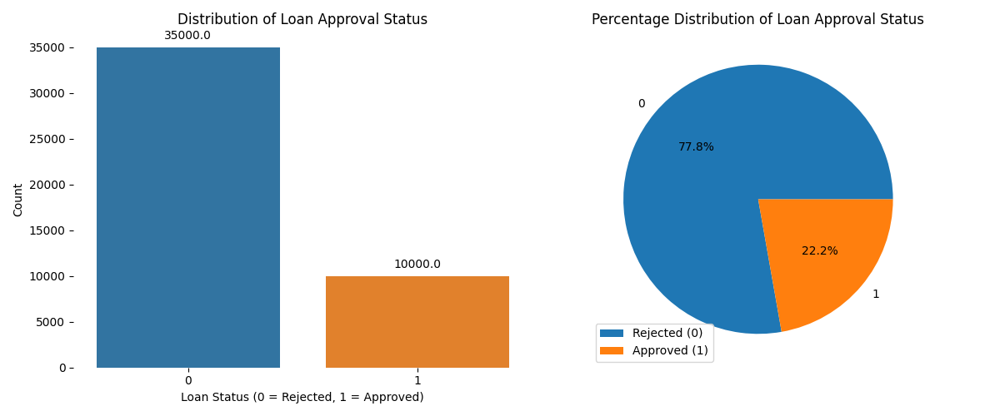
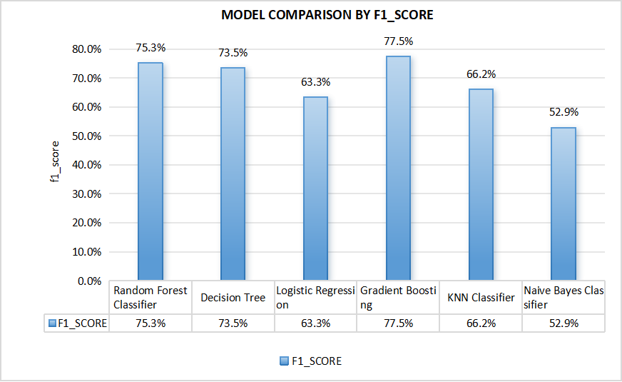

# Loan Approval Prediction Using Python and Machine Learning

## 1. Project Overview
This project demonstrates an end-to-end data science workflow using Python to predict whether a loan application will be approved or rejected. The project uses structured loan application data (sourced from kaggle) and applies exploratory data analysis, data preprocessing, feature transformation, class imbalance handling, supervised machine learning, and model evaluation.


## 2. Objectives
The objectives of this project are to:
  1. Understand the structure and quality of the loan approval dataset.
  2. Analyze applicant, financial, credit history, and loan-related variables.
  3. Prepare the dataset for machine learning through cleaning, encoding, and transformation.
  4. Address class imbalance using resampling techniques.
  5. Train and compare multiple supervised classification models.
  6. Evaluate model performance using appropriate classification metrics.

## 3. Technical Focus
This project highlights the use of Python as a data processing language for a machine learning task. Python was used to:

  -  Load and inspect structured tabular data.
  -  Explore numerical and categorical variables.
  -  Clean and transform raw features.
  -  Encode categorical variables for machine learning.
  -  Handle outliers and class imbalance.
  -  Train and compare classification models.
  -  Evaluate model performance using standard classification metrics.
  -  Document results in a clear and reproducible format.

## 4. Dataset Description
The dataset contains loan application records with applicant, financial, and credit-related variables.

### Target Variable
- `loan_status`: Loan approval status  
  - `1` = Approved  
  - `0` = Rejected
    


### Main Features
- `person_age`: Applicant age
- `person_gender`: Applicant gender
- `person_education`: Highest education level
- `person_income`: Annual income
- `person_emp_exp`: Employment experience
- `person_home_ownership`: Home ownership status
- `loan_amnt`: Loan amount requested
- `loan_intent`: Purpose of the loan
- `loan_int_rate`: Loan interest rate
- `loan_percent_income`: Loan amount as a percentage of income
- `cb_person_cred_hist_length`: Credit history length
- `credit_score`: Applicant credit score
- `previous_loan_defaults_on_file`: Previous default history

## 4. Tools and Technologies Used

| Category | Tools | 
|---|---:|
| Programming Language | Python |
| Data Processing | Pandas, Numpy |
| Data Visualization | Matplotlib, Seaborn |
| Machine Learning | GradientBoosting, RandomForest, DecisionTree, Logistic Regression, Naive Bayes |
| Development Environment | Jupyter Notebook |
| Version Control | Git, Github |

## 5. Project Workflow

The implementation is organized into two main notebooks:
  1. Exploratory Data Analysis
Focuses on understanding the dataset, visualizing feature distributions, checking relationships between variables, and identifying potential data quality issues.
  2. Preprocessing and Modelling
Focuses on preparing the dataset for machine learning, training classification models, evaluating performance, and comparing results.

### 5.1 Exploratory Data Analysis

Notebook link : 

The exploratory notebook focuses on understanding the dataset before modelling. This included:

  - Checking dataset shape, column names, and data types.
  - Reviewing summary statistics for numerical variables.
  - Exploring categorical variable distributions.
  - Analyzing the distribution of the target variable.
  - Comparing loan approval outcomes across applicant characteristics.
  - Creating visualizations to identify patterns in income, credit score, loan amount, loan intent, and previous default history.
  - Checking correlations between numerical variables.
  - Identifying potential outliers.
    
Summary Findings :
The key insights have been organized on : 

### 5.2 Data Preprocessing and Modelling
The preprocessing and modelling notebook prepares the data for machine learning. This included:

- Handling missing records and removing duplicate records if present.
- Handling outliers in numerical columns.
- Reducing rare categories where necessary.
- Encoding categorical variables.
- Log transformation of highly skewed numerical columns
- Splitting the data into training and testing sets.
- Applying resampling techniques to address class imbalance. For this project SMOTE was applied.
- Scaling of numerical columns. Standard Scaler was used
- Training and comparing multiple classification models.

The insights and summary from this step are organized on : 

## 6. Machine Learning Models Compared
The following models were trained and evaluated:

- Gradient Boosting
- Random Forest Classifier
- Decision Tree Classifier
- Logistic Regression
- Naive Bayes Classifier

## 7. Evaluation Approach
Model performance was evaluated using classification metrics such as:

- Accuracy
- Precision
- Recall
- F1-score
- ROC-AUC
- Gini Score

Since loan approval prediction may involve class imbalance, F1-score and recall are especially useful because they provide more information than accuracy alone.

## 8. Key Results



| Model | Gini Score | ROC_AUC | Precision | Recall | F1-Score | Accuracy |
|---|---:|---:|---:|---:| ---:| ---:|
| Gradient Boosting | 0.67 | 83.6% | 85.9% | 70.5% | 77.5% | 90.9% |
| Random Forest | 0.65 | 82.3% | 83.6% | 68.5% | 75.3% | 90.0% |
| Decision Tree | 0.64 | 81.8% | 78.7% | 68.9% | 73.5% | 88.9% |
| KNN Classifier | 0.56 | 78.1% | 66.8% | 65.6% | 66.2% | 85.1% |
| Logistic Regression | 0.56 | 77.8% | 57.5% | 70.5% | 63.6% | 81.8% |
| Naive Bayes | 0.42 | 70.8% | 45.5% | 63.2% | 52.9% | 74.9% |

## 10. Project Files
```text
loan-approval/
│
├── Exploratory Data Analysis.ipynb
├── Preprocess & Modelling.ipynb
├── loan_data.csv
├── README.md
└── images/
    ├── target_distribution.png
    └── model_comparison.png
